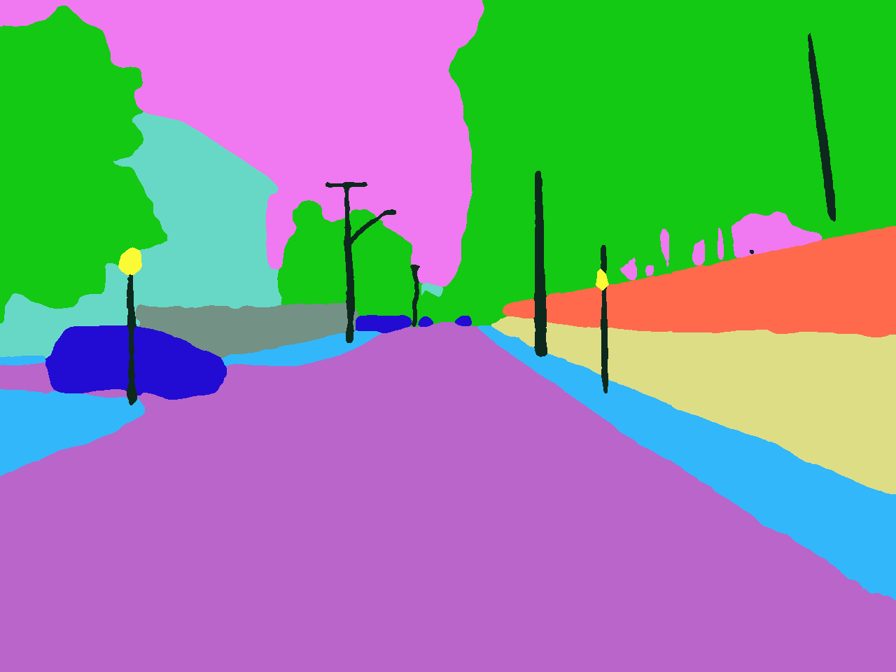
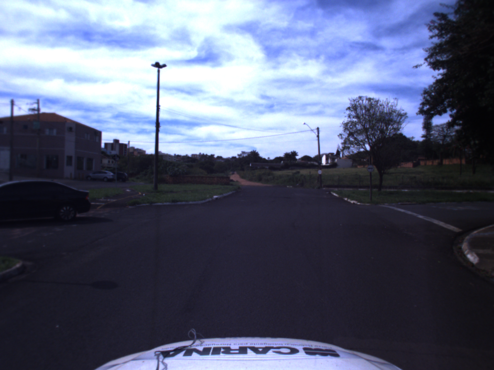
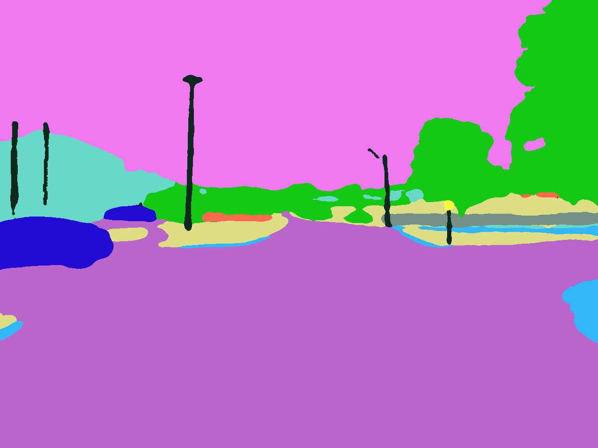
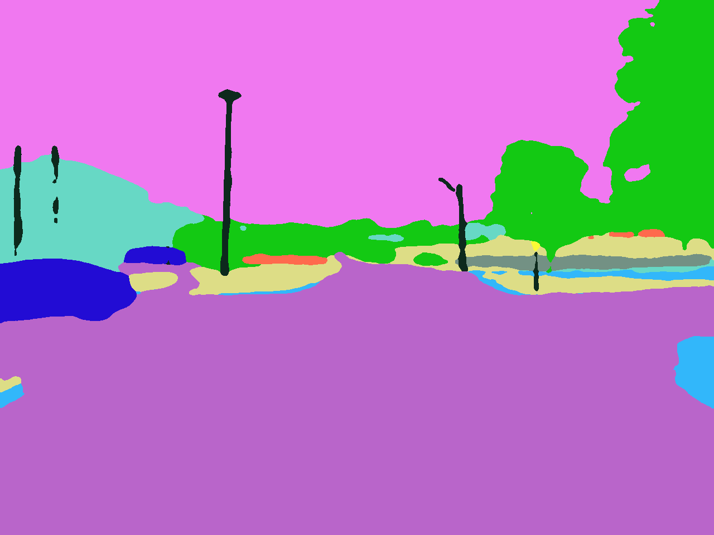

# Segmentação de Imagens com MMsegmentation e ROS2  

<p align="center">
Bem-vindo ao repositório de <strong>segmentação semântica de imagens</strong> utilizando a rede neural <strong>SegFormer B2</strong> com <strong>MMSegmentation e ROS2</strong>.  
Este projeto permite o processamento de imagens em tempo real para aplicações em robótica e veículos autônomos.
</p>

<p align="center">
  <a href="#1-introdução-e-objetivo-">Introdução e Objetivo</a> ·
  <a href="#2-ferramentas-utilizadas-">Ferramentas Utilizadas</a> ·
  <a href="#3-estrutura-do-projeto"->Estrutura do Projeto</a> ·
  <a href="#4-instalação-e-uso-">Instalação e Uso</a> ·
  <a href="#5-informações-do-modelo-segformer-b2-">Informações do Modelo</a> ·
  <a href="#6-dataset-utilizado-">Dataset Utilizado</a> ·
  <a href="#7-comparação-de-resultados-">Comparação de Resultados</a> ·
  <a href="#8-como-contribuir-">Como Contribuir</a> ·
  <a href="#9-licença-">Licença</a> ·
  <a href="#10-agradecimentos-">Agradecimentos</a>
</p>


<p align="center">
  
</p>  

---

## 1. Introdução e Objetivo 📊

A segmentação semântica em tempo real desempenha um papel **crítico** na navegação de veículos autônomos. O **módulo de percepção** desses veículos precisa interpretar rapidamente o ambiente ao seu redor para garantir **segurança, eficiência e tomada de decisões autônoma**.  
  
Em cenários urbanos e rodoviários, um sistema de percepção robusto precisa:  

🔹 **Identificar e classificar objetos** (pedestres, veículos, semáforos, placas de trânsito).  
🔹 **Delimitar vias, calçadas e obstáculos** para tomada de decisão da navegação.  
🔹 **Processar informações em tempo real** para evitar colisões e reagir a eventos inesperados.  
🔹 **Fornecer dados para módulos de planejamento e controle** do veículo.  

A integração do **SegFormer B2** com **ROS2** possibilita a segmentação eficiente de imagens em **tempo real**, tornando este projeto aplicável a sistemas autônomos, visão computacional e robótica.

### **Objetivos do projeto**:
✔ **Pipeline para alcançar a segmentação semântica em tempo real**.  
✔ **Implementação do modelo SegFormer B2** para segmentação semântica.  
✔ **Integração com ROS2** para publicação e processamento de imagens.  
✔ **Suporte para datasets personalizados**.  

---


## 2. Ferramentas Utilizadas 🛠

Este projeto utiliza as seguintes tecnologias:  


- **Linguagem**: Python 
- **Framework de Segmentação**: [MMSegmentation](https://github.com/open-mmlab/mmsegmentation)  
- **Modelo de Segmentação**: SegFormer B2  
- **Middleware de Comunicação**: ROS2 (Robot Operating System 2)  
- **Bibliotecas Auxiliares**:  
   - OpenCV  
   - NumPy  
   - PyTorch  
   - torchvision  
   - mmcv  

---

## 3. Estrutura do Projeto 📂


📁 **Segmentation_MMseg-ROS2-main/**  

├── 📂 `config/` → Configuração da rede e parâmetros  
│   ├── 📄 `define_net.yaml` → Definições do modelo  
│  
├── 📂 `image_processor/` → Scripts de processamento de imagens  
│   ├── 🖼️ `inference_MMSeg.py` → Inferência com MMSegmentation  
│   ├── 🖼️ `inference_personalized.py` → Inferência personalizada  
│   ├── 📡 `image_publisher.py` → Publicação de imagens no ROS2  
│   ├── 📡 `image_subscriber.py` → Assinatura e visualização das imagens segmentadas  
│  
├── 📂 `images_source/` → Imagens de entrada para testes  
├── 📂 `masks_images/` → Máscaras geradas pelo modelo  
├── 📂 `resource/` → Modelos treinados e arquivos auxiliares  
├── 📂 `test/` → Scripts para testes unitários  
│  
├── 📄 `setup.py` → Script de instalação  
├── 📄 `package.xml` → Configuração do ROS2  
├── 📄 `README.md` → Documentação do projeto  

---

## 4. Instalação e Uso ⚙️

### 🔹 Pré-requisitos  
- Python **3.8+**  
- **ROS2 Galactic** ou mais recente  
  - **CUDA** (caso utilize GPU)  
- Dependências Python:  
   - PyTorch  
   - OpenCV  
   - NumPy  
   - MMCV  
   - MMSegmentation

<br>  

### 🚀 Como executar o projeto?  

Para rodar este projeto de segmentação semântica em tempo real utilizando **ROS2 e SegFormer B2**, siga os passos abaixo:

#### 1. **Clone o repositório**  
Faça o download do código-fonte do projeto para sua máquina local executando:

```bash
git clone https://github.com/seu-repositorio.git
cd Segmentation_MMseg-ROS2-main
```

#### 2. **Configure o ambiente ROS2**
Antes de executar o projeto, certifique-se de que o ROS2 Galactic (ou versão mais recente) está instalado e ativado. Execute o seguinte comando:

```bash
source /opt/ros/galactic/setup.bash
```

#### 3. **Compile e execute o workspace ROS2**
Compile os pacotes do ROS2 dentro do diretório do projeto:

```bash
colcon build
source install/setup.bash
```

#### 4. **Inicie o publicador de imagens**
O publicador envia imagens para um tópico ROS2 para serem processadas pelo modelo de segmentação:

```bash
ros2 run image_processor image_publisher.py
```

#### 5. **Rode o assinante para visualizar as imagens segmentadas**
Agora, execute o assinante para receber e exibir as imagens segmentadas:

```bash
ros2 run image_processor image_subscriber.py
```

---

---

## 5. Informações do Modelo **SegFormer B2** 📊

O **SegFormer B2** é um modelo avançado de segmentação semântica, desenvolvido pela **NVIDIA**, projetado para capturar e interpretar informações visuais com alta precisão e eficiência computacional.  

### 🖥️ **Arquitetura do SegFormer B2**  

<p align="center">
  
</p>  

- **Transformers Hierárquicos** → Capturam diferentes níveis de detalhes da imagem, permitindo uma segmentação precisa em múltiplas escalas.  
- **MLP Decoder Leve** → Substitui convoluções pesadas por camadas MLP, reduzindo o custo computacional sem comprometer a qualidade da segmentação.  
- **Backbone EfficientNet-like** → Utiliza uma arquitetura otimizada para menor consumo de memória e maior velocidade de inferência.  
- **Independente de Resolução** → Ao contrário de outras abordagens, o SegFormer pode operar em imagens de diferentes tamanhos sem necessidade de reconfiguração.  
- **Suporte a Inferência em Tempo Real** → Otimizado para execução eficiente em **GPUs NVIDIA com TensorRT e CUDA**, garantindo alta taxa de quadros por segundo (FPS).  

### **Vantagens Técnicas para Aplicações em Veículos Autônomos**  

- **Precisão em Ambientes Complexos** → Permite identificar pedestres, veículos, semáforos e obstáculos com alto grau de confiabilidade.  
- **Baixo Custo Computacional** → Pode ser executado em embarcados e dispositivos com capacidade limitada, como **Jetson Xavier** e **Orin**.  
- **Integração com ROS2** → Facilita a comunicação entre sensores e módulos de tomada de decisão do veículo.  
- **Generalização para Diferentes Cenários** → Pode ser treinado em datasets específicos para ambientes urbanos, rodoviários ou industriais.  

Mais detalhes podem ser encontrados na **[documentação oficial do SegFormer](https://github.com/NVlabs/SegFormer)**.  

---

## 6. Dataset Utilizado 🏙️

📌 O projeto utiliza por padrão o dataset **Cityscapes**, que contém imagens de ruas urbanas anotadas para segmentação.  

📌 **Características do dataset**:  
✅ **Formato**: PNG com anotações de segmentação.  
✅ **Número de Classes**: 19 categorias (carros, pedestres, estradas, edifícios, etc.).  
✅ **Resolução**: 1280 x 720 pixels (HD).  

📌 **Usando um dataset personalizado**  
Para utilizar outro dataset, basta alterar os arquivos de configuração e anotações do modelo.

---

## 7. Comparação de Resultados 📊

A segmentação semântica em tempo real é um fator **crítico** para aplicações como **veículos autônomos e robótica**, onde o tempo de resposta e a precisão são essenciais para uma navegação segura. Para avaliar o desempenho dos diferentes modelos, comparamos **FPS de inferência, tempo médio por imagem, consumo computacional (FLOPs) e precisão**.

Abaixo, apresentamos os **resultados obtidos** na segmentação de imagens utilizando diferentes arquiteturas:  

---

### 🖼️ **Exemplo de saída do modelo**  

| 📷 Entrada |  🎨 Ground Truth | 🎨 Segmentação - SegFormer B2 | 🎨 Segmentação - DeepLabV3 |
|-----------|-----------------------------|--------------------------|----------------------|
|  |  |  |  |

📌 **Observação:** As diferenças entre os modelos podem ser notadas na suavização dos contornos, detalhamento das bordas e segmentação precisa de classes menores.

---

### 📈 **Tabela de Comparação entre Modelos**  

| **Modelo** | **Configuração** | **FPS (Inferência)** | **Tempo por Imagem (seg)** | **FLOPs (TeraOps)** | **Número de Parâmetros (Milhões)** | **Precisão (%)** |
|------------|-----------------|----------------------|--------------------------|----------------------|----------------------------------|------------------|
| **SegFormer B2** | `segformer_mit-b2_8xb1-160k_cityscapes-1024x1024` | **6.70 img/s** | 0.149 seg/img | 0.123T | 24.7M | **87.8%** |
| **DeepLabV3 R50-D8** | `deeplabv3_r50-d8_4xb2-40k_cityscapes-512x1024` | 3.18 img/s | 0.314 seg/img | 0.949T | 65.7M | 85.7% |
| **PSPNet R50-D8** | `pspnet_r50-d8_4xb2-40k_cityscapes-512x1024` | 6.42 img/s | 0.156 seg/img | 0.628T | 46.6M | 82.3% |
| **FCN R50-D8** | `fcn_r50-d8_4xb2-40k_cityscapes-512x1024` | 6.30 img/s | 0.159 seg/img | 0.696T | 47.1M | 81.3% |
| **FCN R18-D8** | `fcn_r18-d8_4xb2-80k_cityscapes-512x1024` | **28.93 img/s** | 0.035 seg/img | 0.195T | 12.6M | 77.8% |
| **FPN R50** | `fpn_r50_4xb2-80k_cityscapes-512x1024` | **24.85 img/s** | 0.040 seg/img | **0.160T** | 28.4M | 79.7% |

---

### 📌 **Análise dos Resultados**  

📌 **SegFormer B2** apresenta **o melhor equilíbrio entre velocidade e precisão**, tornando-se ideal para aplicações em tempo real, como veículos autônomos.  

📌 **FCN R18-D8 e FPN R50** são **mais rápidos**, mas sacrificam a precisão, sendo mais adequados para sistemas com restrições computacionais.  

📌 **DeepLabV3 R50-D8** oferece uma boa precisão, mas tem um **alto custo computacional** e um FPS reduzido, o que pode comprometer sua aplicação em tempo real.  

📌 **PSPNet R50-D8** e **FCN R50-D8** possuem **desempenho intermediário**, sendo opções equilibradas para tarefas que exigem boa segmentação sem sacrificar tanto a eficiência.  

💡 **Conclusão:** O **SegFormer B2** se destaca para aplicações onde **tempo de resposta e precisão são cruciais**, como veículos autônomos. Modelos mais leves como **FCN R18-D8** podem ser usados para sistemas embarcados com menos poder computacional.  

---

## 8. Como Contribuir? 🤝

Contribuições são sempre bem-vindas!

💡 **Se tiver dúvidas, sinta-se à vontade para abrir uma "Issue" e discutir sua ideia antes de contribuir!** 🚀  

---

## 9. Licença 📜

Este projeto é distribuído sob a **Licença MIT**, permitindo uso, modificação e distribuição livremente, desde que os devidos créditos sejam mantidos.  

📄 Consulte o arquivo `LICENSE` para mais detalhes sobre os termos da licença.  

---

## 10. Agradecimentos 🙏

Gostaríamos de expressar nosso profundo agradecimento ao **Laboratório de Robótica Móvel (LRM) do ICMC-USP** pelo suporte e infraestrutura fornecidos para o desenvolvimento deste projeto.  

